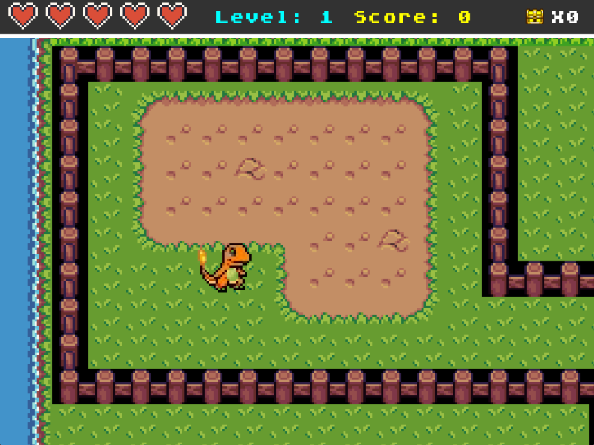

# Festive Fusion

### A 2D game built with Pygame featuring Halloween, Christmas, and Thanksgiving themed levels, combat mechanics, and score tracking.

## Features

- Three unique themed levels with different enemies and items
- Real-time combat system with fireball mechanics
- Enemy AI with pathfinding and attack patterns
- Collectible items and health potions
- Save/Load game functionality
- High score leaderboard system
- Smooth scrolling camera
- Sound effects and background music

## Installation

1. Ensure you have Python installed and Pygame library installed `pip3 install pygame`
2. If you get error when installing it likely due to python 3.11 or higher, try creating a virtual environment and install pygame there.
3. Clone the repository
4. Run the game `python main.py`
   
## Controls

- **W**: Move Up
- **S**: Move Down
- **A**: Move Left
- **D**: Move Right
- **Left Click on Enemy**: Shoot Fire Blast (Signature Move of Charmander)
- **ESC**: Pause game

## Technical Implementation

### Core Systems
- State management using Memento pattern
- Factory pattern for item creation
- Singleton pattern for world management
- Collision detection and physics
- Sprite animation system
- Score tracking and persistence

### Character Types
- Player character with combat mechanics
- Skeleton enemy with AI pathfinding

## Save System

The game features a comprehensive save system that persists in `save_game.json`:
- Player health
- Collected items
- Killed enemies
- Current level progress
- Total score

## Scoring System

Points are awarded for:
- Collecting coins: 10 points
- Defeating enemies: 100 points

High scores are stored in `scoreboard.json` and displayed on the leaderboard.

## Technical Requirements

- Python 3.x
- Pygame library
- Minimum resolution: 800x600